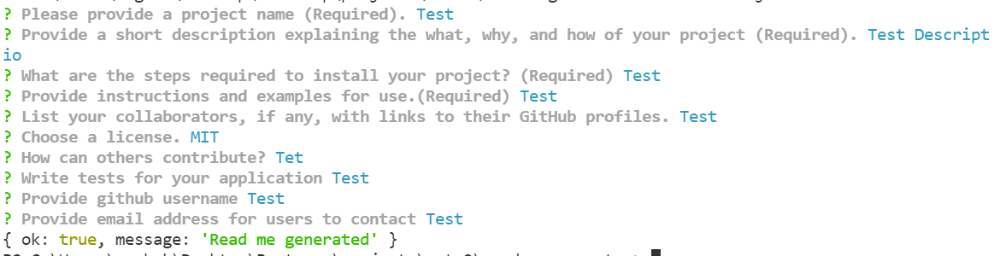

# Read Me Generator

## Description

This is a command line application that generates a readme file based on the user input. 
The readme file will include the following questions:
- Please provide a project name (Required).
- Provide a short description explaining the what, why, and how of your project (Required).
- What are the steps required to install your project? (Required)
- Provide instructions and examples for use.(Required)
- List your collaborators, if any, with links to their GitHub profiles.
- Choose a license. Options MIT, Apache, GNU, BSD, None
- How can others contribute?
- Write tests for your application
- Provide github username
- Provide email address for users to contact

The readme will also have a badge for the license selected by the user.
There will be a table of contents with links to each section.
   
    
## Table of Contents
    
- [Installation](#installation)
- [Usage](#usage)
- [Questions](#questions)
    
       
## Installation
    
To run the command line application.
- Clone the repository
- Run npm install

## Usage

Run node index.js from the project directory to run the application.
Provide user inputs for the questions.
Check console for any errors.
If the program runs without errors, the dist folder will have the newly generated readme file.
Use as required.

## Command line app screenshot

## Link to demo video

Use the following video to access a short demo on the application.
https://drive.google.com/file/d/1oKsWyQ_f57a4nx30xRrrgAMHYd5d6Hdf/view?usp=sharing

# Questions

if you have any questions about the repository, open an issue/pr or contact me directly at megha.nambiar@gmail.com 
You can find more of my work at [Github](https://github.com/meghark).

    